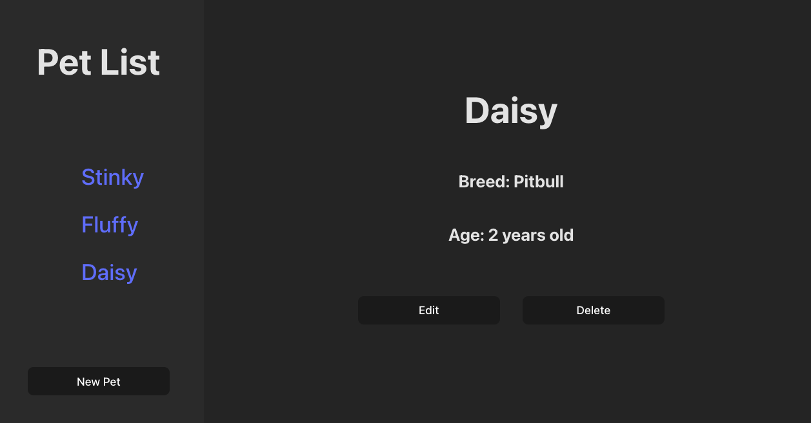

<h1>
  React
  Pets Front-End
</h1>

## About

Welcome to Reactville, a constantly evolving virtual metropolis. Let's build this digital town together, one component at a time.

The Reactville Animal Shelter is seeking a solution to keep track of all the animals currently available for adoption. You will help them build an interactive dashboard where shelter staff can add, update, and remove animals throughout the adoption process. Let's help these pets find their fur-ever home!

By the end of this lab, students will have a front end that consumes a RESTful API, allowing users to create, read, update, and delete data. This lesson is a basic introduction to consuming APIs with React and **does not** include React Router to change views; instead, students will use conditional rendering to display different components in a dashboard layout.

## Content

| Lesson                                                                     | Skills                                                                          |
| -------------------------------------------------------------------------- | ------------------------------------------------------------------------------- |
| [Setup](./setup/README.md)                                                 | Setting up the development environment.                                         |
| [Environment Variables in Vite](./environment-variables-in-vite/README.md) | Using environment variables in a Vite project.                                  |
| [Intro](./intro/README.md)                                                 | Scoping minimum requirements and building component hierarchy.                  |
| [Read - Index](./read-index/README.md)                                     | Connect a React application to an API to fetch and display a list of items.     |
| [Read - Show](./read-show/README.md)                                       | Use React components to display details about an individual item from API data. |
| [Build the Create Form](./build-the-create-form/README.md)                 | Create and manage forms in React to add new pet entries to a database.          |
| [Create and Display a New Pet](./create-and-display-a-new-pet/README.md)   | Handle the form submission call to the API and display the new pet in the UI.   |
| [Update](./update/README.md)                                               | Make update calls to an API and refresh the app state to reflect those changes. |
| [Delete](./delete/README.md)                                               | Make delete requests to an API and remove items from the user interface.        |
| [Add CSS](./add-css/README.md)                                             | Applying CSS Styles to your pet dashboard.                                      |

## References

📖 [Reference Materials](./references/README.md)

## Internal

### Prerequisites

- Controlled Forms in React
- Lifting State in React
- Fetching Data in React
- Express API - Pets Back-End

### Starter code

This module requires an existing API to perform CRUD operations on the resource `pets`.

🟢 [Express API starter code](https://git.generalassemb.ly/modular-curriculum-all-courses/express-api-pets-back-end-solution)

### Solution code

🏁 [Solution code](https://git.generalassemb.ly/modular-curriculum-all-courses/react-pets-front-end-solution)

### Course landing pages

- [SEB - Software Engineering Bootcamp](https://pages.git.generalassemb.ly/modular-curriculum-all-courses/react-pets-front-end/canvas-landing-pages/seb.html)
- [Fallback](https://pages.git.generalassemb.ly/modular-curriculum-all-courses/react-pets-front-end/canvas-landing-pages/fallback.html)

### Resources

✏️ [Instructor Guide](./internal-resources/instructor-guide.md)

🎥 [Video Hub](./internal-resources/video-hub.md)

🏗️ [Release Notes](./internal-resources/release-notes.md)

---

**Find a 👾 bug 👾 or have suggestions? [Let us know](https://pages.git.generalassemb.ly/modular-curriculum-all-courses/universal-resources-internal/module-feedback.html)!**
