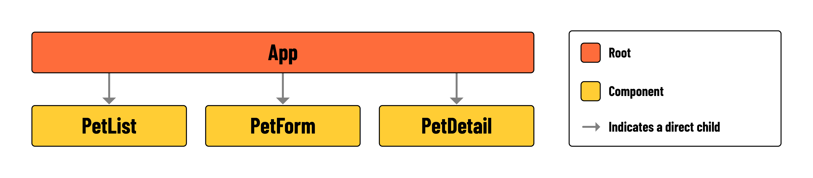

<h1>
  Pets Front-End
  Intro
</h1>

**Learning Objective**: By the end of this lesson, the learner will understand the application's minimum requirements and component hierarchy.

## Introduction

In this lesson, you'll build a single-page application (SPA) using React. You will also use `fetch()` to consume from a previously built RESTful API. You will be able to create, read, update, and delete (CRUD) pets from the API and conditionally render the UI based on the application's state.

## Minimum requirements

| Feature               | Requirements                                                                                                            |
| --------------------- | ----------------------------------------------------------------------------------------------------------------------- |
| **Read all pets**     | - Display all pets in the UI.                                                                                           |
| **Read a single pet** | - Add a link to view the details of a single pet. - Conditionally render the details of a single pet.                |
| **Create a new pet**  | - Conditionally render a form to create a new pet. - Handle the form submission - Display the new pet in the UI.  |
| **Update a pet**      | - Conditionally render a form to update a pet. - Handle the form submission. - Display the updated pet in the UI. |
| **Delete a pet**      | - Add a button to delete a pet. - Remove the pet from the UI.                                                        |

## Component hierarchy

This dashboard-style app does not feature any routing, meaning the user will not navigate between pages in this build. However, when working with React, this doesn't mean you are limited to using a single component - far from it! Your single page will be made up of multiple components, so it's still a good idea to map out the component hierarchy and get an overview of the app layout before you start coding:

The page will have a layout similar to a dashboard. Different sections will show or hide components depending on what's needed at the time. This means parts of the page can change based on user actions or other factors, keeping the display relevant and interactive.
